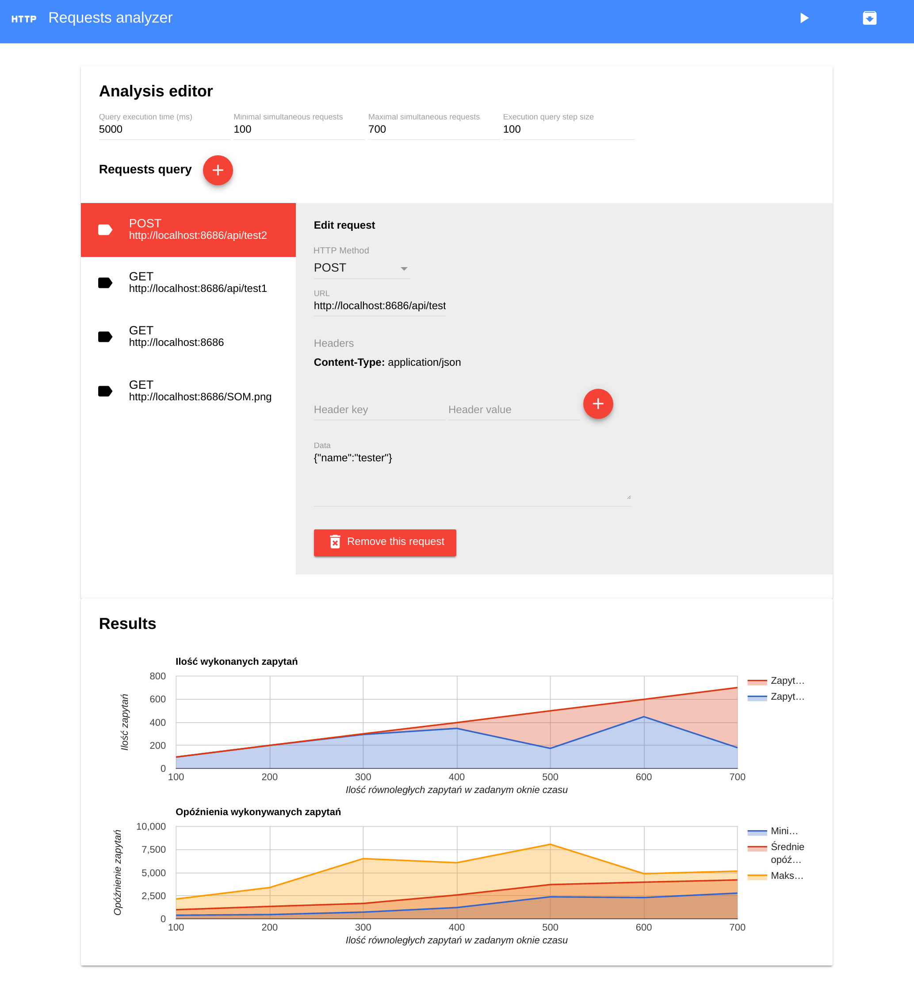

Angular2 electron application to analyze HTTP requests quality. It's simple student project.

# Screenshot



# Build & development (with angular cli)

```bash

# angular2 cli required
npm install -g angular-cli

# install
npm install

# run webpack dev server
npm start

# build angular project
npm run build

# preview electron (without angular build)
npm run electron

# create electron package (build included)
npm run package

```
